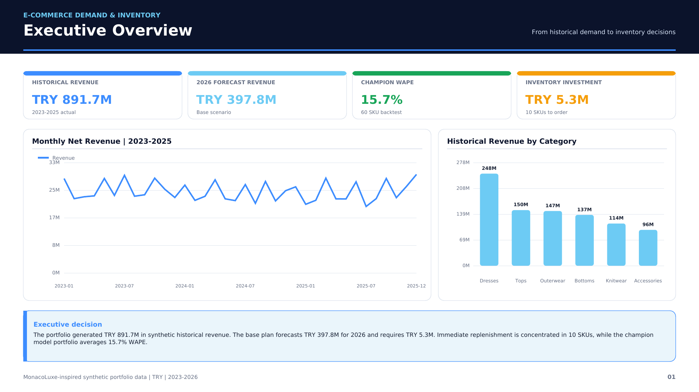
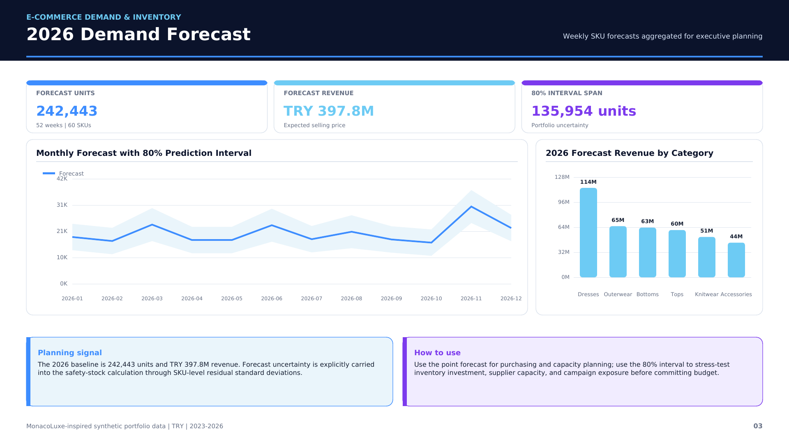
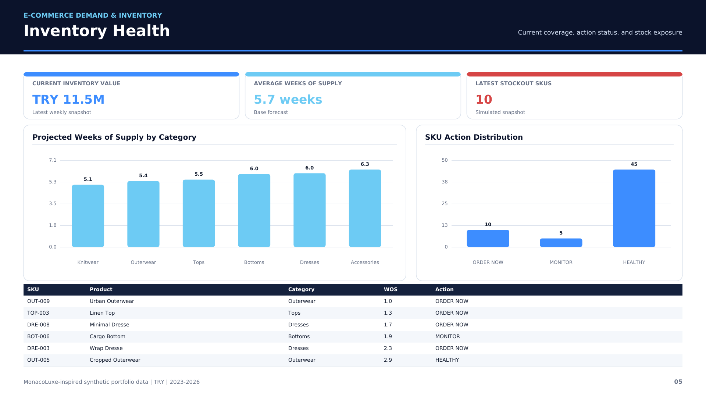
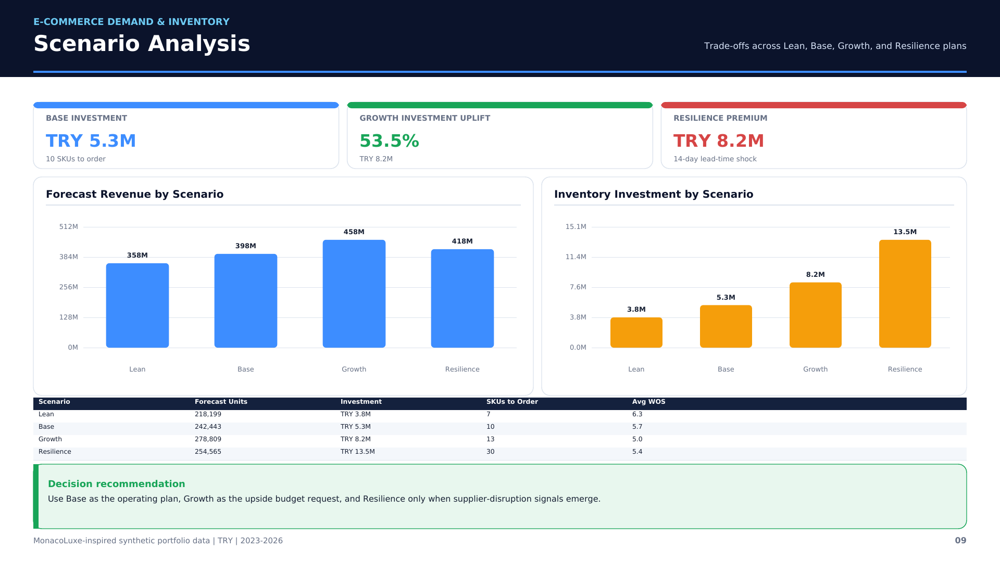
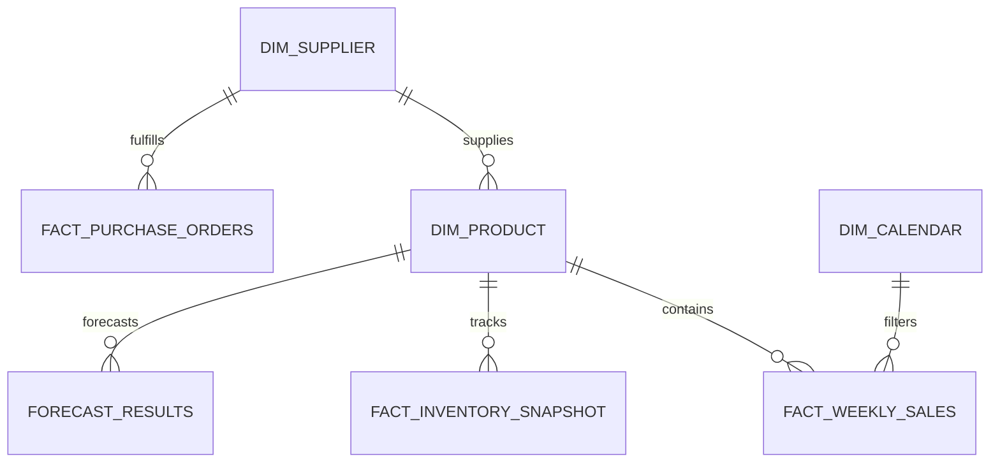

# E-Commerce Demand Forecasting & Inventory Optimization Platform



An end-to-end analytics portfolio project that converts three years of synthetic
fashion e-commerce demand, sales, inventory, promotion, purchase-order, and
supplier data into a governed 52-week forecast and SKU-level replenishment plan.

The platform answers a practical management question:

> How much should the business buy, when should it order, and how much working
> capital is required under different demand and supply-risk scenarios?

The business context is inspired by the author's MonacoLuxe entrepreneurship
experience. All records are synthetic and contain no real customer, company, or
commercially sensitive data.

## Executive Results

| Decision metric | Result |
|---|---:|
| Historical period | 2023–2025 |
| Historical revenue | TRY 891.7M |
| Product portfolio | 60 SKUs across 6 categories |
| Forecast horizon | 52 weeks for 2026 |
| Base forecast | 242,443 units / TRY 397.8M revenue |
| Average champion WAPE | 15.7% |
| Base recommended investment | TRY 5.3M |
| Base immediate-order SKUs | 10 |
| Planning scenarios | Lean, Base, Growth, Resilience |

Gradient Boosting was selected for 55 SKUs and Seasonal Naive for 5 SKUs
through a SKU-level champion selection process. Model governance uses a
13-week holdout and compares WAPE, MAE, RMSE, and bias.

## Business Problem

Historical sales reporting alone does not answer forward-looking inventory
questions. Fashion demand changes with seasonality, campaigns, channels,
product lifecycle, and stock availability. Buying too little creates lost
sales; buying too much locks working capital and increases markdown risk.

This project integrates forecasting and inventory mathematics so that demand
signals are converted into:

- Safety stock
- Reorder points
- Economic order quantities
- Case-pack and MOQ-compliant purchase recommendations
- Inventory investment requirements
- Scenario-based management decisions

## Analytics Architecture


The complete pipeline is deterministic. A fixed random seed allows the data,
models, forecasts, recommendations, validation controls, and reporting tables to
be regenerated consistently.

## Tools & Technologies

- **Python:** pandas, NumPy, scikit-learn, SciPy, pytest
- **Forecasting:** Seasonal Naive, 8-Week Moving Average, Gradient Boosting
- **Inventory science:** safety stock, reorder point, EOQ, service levels
- **SQL:** SQLite relational database, analytical views, reusable queries
- **Power BI:** PBIP project, semantic model, DAX measures, 10 report pages
- **Microsoft Excel:** 15-sheet formula-driven scenario planning workbook
- **Reporting:** two 20-slide PowerPoint decks and a 10-page vector PDF
- **Quality controls:** business-rule validation, unit tests, PBIP validation,
  formula scanning, slide overflow tests, and visual render inspection

## Repository Outputs

| Deliverable | Description | Open / download |
|---|---|---|
| Power BI | 10-page PBIP project with embedded data | [Power BI project](PowerBI/Ecommerce_Demand_Inventory_PBIP/) |
| Excel | Interactive scenario and replenishment planner | [Excel workbook](Excel/Ecommerce_Demand_Inventory_Scenario_Planner.xlsx) |
| English presentation | 20-slide professional executive deck | [English PowerPoint](Presentation/Ecommerce_Demand_Forecasting_Inventory_Optimization_Professional_Deck_EN.pptx) |
| Turkish presentation | 20-slide professional executive deck | [Turkish PowerPoint](Presentation/E_Ticaret_Talep_Tahmini_Stok_Optimizasyonu_Profesyonel_Sunum_TR.pptx) |
| Executive report | 10-page vector 16:9 PDF, rendered and checked at 1920×1080 | [HD PDF](Reports/Ecommerce_Demand_Inventory_10_Page_Vector_HD.pdf) |
| SQL database | Portable SQLite database | [SQLite database](SQL/ecommerce_demand_inventory.db) |
| Source data | Dimensions, facts, forecasts, and recommendations | [Data folder](Data/) |

## Dashboard Preview







## Data Model

The project uses dimensions for calendar, product, and supplier attributes,
supported by fact tables at weekly sales, weekly inventory, purchase-order,
promotion, forecast, and scenario-SKU grains.



See [Data Dictionary](docs/data_dictionary.md) and
[Analytics Methodology](docs/methodology.md) for detailed definitions.

## Forecasting Methodology

1. Generate three years of weekly SKU-channel demand with trend, seasonality,
   promotions, price, lifecycle, and stockout effects.
2. Reserve the most recent 13 weeks as an out-of-sample backtest.
3. Train three candidate models for each SKU.
4. Evaluate WAPE, MAE, RMSE, and bias.
5. Select the lowest-WAPE champion per SKU.
6. Refit the champion on full history and forecast 52 weeks.
7. Construct an 80% prediction interval from residual uncertainty.
8. Pass the forecast and uncertainty to the inventory engine.

## Inventory Optimization

The inventory engine combines each SKU's demand, forecast error, target service
level, supplier lead time, order cost, unit cost, current stock, on-order stock,
MOQ, and case pack.

Core calculations:

- `Safety Stock = z × residual standard deviation × √(lead-time weeks)`
- `Reorder Point = lead-time demand + safety stock`
- `EOQ = √(2 × annual demand × order cost / annual holding cost per unit)`
- `Inventory Position = on-hand + on-order`

Recommendations are rounded to the SKU case pack and respect minimum-order
constraints. Four scenarios stress demand, service level, and lead time.

## Scenario Summary

| Scenario | Forecast revenue | Inventory investment | SKUs to order | Decision use |
|---|---:|---:|---:|---|
| Lean | TRY 358.0M | TRY 3.8M | 7 | Capital preservation |
| Base | TRY 397.8M | TRY 5.3M | 10 | Expected operating plan |
| Growth | TRY 457.5M | TRY 8.2M | 13 | Demand upside |
| Resilience | TRY 417.7M | TRY 13.5M | 30 | 14-day lead-time shock |

## Power BI Report Pages

1. Executive Overview
2. Demand History
3. Demand Fulfillment
4. Revenue & Margin
5. Inventory Health
6. SKU Performance
7. Category Performance
8. Product Segments
9. Forecast Accuracy
10. History & Forecast

The semantic model embeds the synthetic reporting data, so the PBIP project does
not require local CSV path remapping.

## Excel Workbook

The workbook contains 15 formatted sheets, including:

- Executive Dashboard
- Scenario Planner
- Replenishment
- Forecast Accuracy
- Monthly Performance
- Product Portfolio
- Supplier Scorecard
- Assumptions, checks, sources, and data dictionary

The Scenario Planner includes a dropdown for Lean, Base, Growth, and Resilience.
Formula-driven outputs update revenue, investment, order units, service-stock
assumptions, and budget status.

## Reproduce the Analytics Pipeline

```bash
python -m venv .venv
source .venv/bin/activate
pip install -r requirements.txt
export PYTHONPATH=Python/src
python -m ecom_opt.run_pipeline
pytest -q
```

On Windows PowerShell:

```powershell
py -m venv .venv
.\.venv\Scripts\Activate.ps1
pip install -r requirements.txt
$env:PYTHONPATH = "Python/src"
python -m ecom_opt.run_pipeline
pytest -q
```

## Validation

The generated validation report confirms:

- 60 unique SKUs and valid supplier keys
- Historical coverage from 2 January 2023 to 29 December 2025
- 3,120 complete forecast rows: 52 weeks × 60 SKUs
- Exactly one champion model for every SKU
- Finite model performance metrics
- Demand balance between sold units and estimated lost sales
- Non-negative inventory balances
- Every order recommendation rounded to the case pack
- Valid PBIP structure: 10 pages, 81 visuals, 5 model tables, 3 relationships
- No Excel formula errors
- No PowerPoint canvas overflow in either 20-slide deck

## Repository Structure

```text
ecommerce-demand-inventory-optimization/
├── Data/                 Synthetic facts, dimensions, forecasts, scenarios
├── Excel/                Interactive scenario planning workbook
├── Images/               Portfolio-ready report and dashboard previews
├── PowerBI/              10-page PBIP report and semantic model
├── Presentation/         Turkish and English 20-slide executive decks
├── Python/               Data, forecasting, inventory, validation source code
├── Reports/              10-page vector HD executive PDF
├── SQL/                  Schema, views, queries, and SQLite database
├── Tools/                Artifact build scripts
├── docs/                 Technical and user documentation
├── README.md
├── LICENSE
└── requirements.txt
```

## Important Limitations

- The dataset is synthetic and intended for portfolio demonstration.
- Forecasts are planning estimates, not guaranteed commercial outcomes.
- The project demonstrates batch analytics; a production implementation would
  add scheduled ingestion, model monitoring, access controls, and approval
  workflows.
- TRY values are illustrative and do not represent actual MonacoLuxe results.

## Author

**Murat Miraç Gedik**  
Statistics · Business Intelligence · Forecasting · Entrepreneurship  
[GitHub profile](https://github.com/muratmiracg-dev)

## License

This project is released under the [MIT License](LICENSE).
